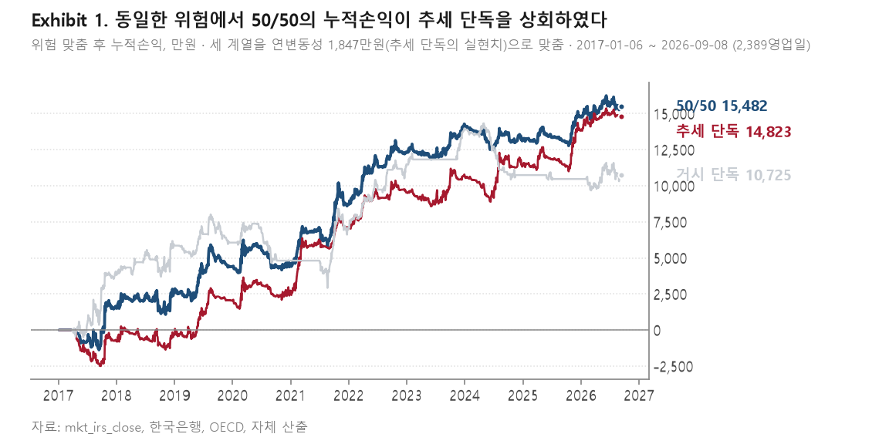
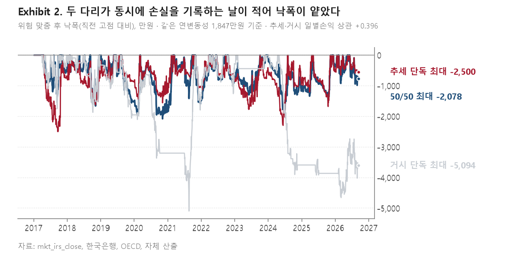

# 등록 북(추세·거시 50/50)의 백테스트 보고

원화 이자율스왑 시계열 모멘텀, 운용역 보고

작성일 2026-09-14 · 정오표 2026-09-15 (`docs/ERRATUM_blend_5050_2026-09-15.md`) · 판정문 `Momentum-blend-IRS-legs-paper` · 근거자료 `docs/EVAL_LANE_STATE.md`, `docs/MOMENTUM_RESEARCH_2026-09-10.md`, `data/krw-macro-vintage/PREREG.md`

---

## Ⅰ. 보고 요지

### 1.1 보고 사유

본 데스크가 2026년 9월 8일에 동결한 모멘텀 사전등록의 대상은 **추세 다리와 거시
다리를 위험기준 50 대 50으로 결합한 북**이다. 그러나 2026년 9월 11일에 제출한 세
건의 문서(1매 보고, 슬리브 신설 제안, 검토 보고)는 모두 **추세 다리 단독** 성과
위에 작성되었다.

이는 거시 다리를 배제하기로 결정한 결과가 아니라, 계기(instrument)를 국채선물에서
이자율스왑으로 이전하는 과정에서 거시 다리가 이전되지 않은 누락에 해당한다. 해당
누락은 2026년 9월 11일에 확인되어 보완하였으며, 본 보고서는 **등록된 구조 그대로의
북**에 대한 백테스트 결과를 보고한다.

### 1.2 판단을 요청하는 사항

평균회귀 장부에 부속 구성으로 신설할 슬리브를 **등록된 50/50 구조로 할 것인지,
추세 단독으로 할 것인지**에 대한 결정을 요청한다. 두 구성의 우열은 평가 기준에
따라 갈리며, 그 내용은 Ⅴ장에 정리하였다.

### 1.3 결과 요약

| 항목 | 50/50 | 추세 단독 | 거시 단독 |
|---|---|---|---|
| 연환산 Sharpe 비율 | 0.884 | 0.846 | 0.612 |
| 자기상관 보정 Sharpe 비율 | 0.926 | 0.906 | 0.604 |
| 변동성 정규화 CDaR 비율 | 0.176 | 0.078 | 산출하지 않음 |
| 세 관문 판정 | 통과 | 통과 | **미통과** |
| 평균회귀 장부 결합 시 Calmar 개선 | +0.234 | **+0.309** | 산출하지 않음 |
| 위 개선이 반대 방향일 확률 | 0.077 | **0.040** | 해당없음 |

단독 성과와 검정 관문에서는 50/50이 우위에 있으나, 평균회귀 장부와 결합하는
용도에서는 추세 단독이 우위에 있다. 거시 다리는 단독으로는 위약 검정을 통과하지
못하며, 50/50의 성과는 거시 다리 자체의 예측력보다 **두 다리의 낮은 상관에서
발생하는 분산효과**에 기인한다.

---

## Ⅱ. 등록된 북의 구성

| 항목 | 내용 |
|---|---|
| 계기 | 원화 이자율스왑 3년물, 10년물 par 금리 (부호를 반전한 -bp 계열) |
| 추세 다리 | 이동평균 교차, 룩백 다섯(20·40·60·120·250영업일) 등가중 |
| 거시 다리 | 네 테마 합성 신호 `macro_sign`의 부호를 외부 신호로 투입 |
| 네 테마 | 경기순환, 통화정책, 국제교역, 위험선호 |
| 결합 비중 | 두 다리의 일별 손익을 0.5 대 0.5로 합산 |
| 계약별 변동성 창 | 60영업일 |
| 북 변동성 창 / 목표 | 120영업일 / 하루 표준편차 100만원 |
| 거래비용 가정 | 편도 0.5bp (왕복 1.0bp) |
| 표본 | 2017년 1월 6일부터 2026년 9월 8일까지 2,389영업일, 9.48년 |
| 시행수 N | 72 (신호계 × 변동성 창 × 다리 구성 × 계기 둘) |

거시 다리의 네 테마 가운데 통화정책과 위험선호는 2026년 9월 11일에 원논문(Brooks,
2017, Appendix B)의 정의로 수정하였다. 통화정책은 국고채 1년물에서 통화안정증권
2년물로, 위험선호는 주식 대비 채권 초과수익에서 주식 대비 무위험자산 초과수익으로
교체하였다. 이는 성과를 관찰하고 선택한 변경이 아니라 원문과 대조하여 어긋난 정의를
되돌린 것이므로 자유도를 소비하지 않는다.

---

## Ⅲ. 백테스트 결과

### 3.1 위험 맞춤의 필요성

세 계열은 각각 북 변동성 목표를 적용하지만, 50/50은 두 다리를 반씩 합산한 결과이므로
두 다리의 상관이 1보다 작은 만큼 **변동성이 자동으로 낮아진다**. 실측 연변동성은
50/50이 1,309만원, 추세 단독이 1,847만원, 거시 단독이 1,208만원이다.

이를 조정하지 않고 비교하는 경우 50/50의 낙폭이 얕은 현상의 상당 부분이 위험을 덜
부담한 데서 발생하게 된다. 본 데스크는 이전 검정에서 동일한 오류를 경험한 바 있다
(`EVAL_LANE_STATE.md` §22-1). 따라서 <그림 1>과 <그림 2>는 **세 계열을 추세 단독의
실현 연변동성 1,847만원으로 맞춘 뒤** 작성하였다. 추세 단독 계열은 원 백테스트
그대로이며, 나머지 두 계열이 그 위험 수준으로 조정된 것이다.

### 3.2 누적손익

<그림 1>은 위험 맞춤 후 세 계열의 누적손익을 보여준다. 동일한 위험을 부담하였을 때
50/50의 누적손익은 1억 5,482만원으로 추세 단독의 1억 4,823만원을 상회하였다. 거시
단독은 1억 725만원으로 가장 낮았다.

### 3.3 낙폭

<그림 2>는 동일한 위험 기준에서의 낙폭 경로이다. 최대낙폭은 50/50이 2,078만원,
추세 단독이 2,500만원, 거시 단독이 5,094만원으로 나타났다. 50/50의 낙폭이 얕은
이유는 두 다리의 일별손익 상관이 +0.396에 머물러 **동시에 손실을 기록하는 날이
적기 때문**이다. 원논문이 보고한 매크로 모멘텀과 추세추종 간 상관 0.4와 근접한
값이며, 이는 동일한 성격의 신호를 구현하였음을 시사한다.

### 3.4 요약 지표

위험 맞춤 후 기준이며, 금액 단위는 만원이다.

| 지표 | 50/50 | 추세 단독 | 거시 단독 |
|---|---|---|---|
| 누적손익 | 15,482 | 14,823 | 10,725 |
| 최대낙폭 | -2,078 | -2,500 | -5,094 |
| Calmar 비율 | 0.79 | 0.63 | 0.22 |
| 연환산 Sharpe 비율 | 0.884 | 0.846 | 0.612 |
| 승률 (무포지션 포함) | 0.473 | 0.465 | 0.265 |
| 원 계열 연변동성 | 1,309 | 1,847 | 1,208 |

### 3.5 연도별 손익

위험 맞춤 후 기준이며, 단위는 만원이다. 2026년은 9월 8일까지이다.

| 연도 | 50/50 | 추세 단독 | 거시 단독 |
|---|---|---|---|
| 2017 | 1,546 | -752 | 3,840 |
| 2018 | 1,019 | 406 | 2,011 |
| 2019 | 1,817 | 2,375 | 209 |
| 2020 | 229 | 695 | -1,250 |
| 2021 | 4,132 | 4,377 | 2,292 |
| 2022 | 3,597 | 2,429 | 4,374 |
| 2023 | 1,940 | 1,249 | 2,497 |
| 2024 | -1,133 | 602 | -3,233 |
| 2025 | 1,635 | 2,466 | -273 |
| 2026 | 699 | 977 | 257 |

50/50과 추세 단독은 모두 10개 연도 중 9개 연도에서 양(+)의 손익을 기록하였다. 다만
손실 연도가 서로 다르다. 추세 단독은 2017년에, 50/50은 거시 다리가 3,233만원의
손실을 기록한 2024년에 각각 음(-)의 손익을 보였다. 이러한 결과는 두 다리가 서로
다른 국면에서 손실을 기록함을 의미하며, 3.3에서 관찰한 낙폭 축소와 같은 현상이다.

---

## Ⅳ. 검정 관문

본 데스크의 평가층은 세 관문을 적용한다. Deflated Sharpe Ratio는 시행수를 반영하여
Sharpe 비율을 할인한 값이고, Backtest Overfitting 확률은 조합적 교차검증으로 산출한
과최적화 확률이며, 위약 검정은 포지션의 **노출 일정과 크기를 그대로 둔 채 방향만
순환이동시켜** 재집행한 189회 분포에서의 경험적 p값이다.

| 항목 | 50/50 | 추세 단독 | 거시 단독 | 문턱 |
|---|---|---|---|---|
| Deflated Sharpe Ratio | 0.9893 | 0.9828 | 0.9507 | > 0.95 |
| Backtest Overfitting 확률 | 0.2186 | 0.2101 | 0.4873 | < 0.50 |
| 위약 p (비용 후) | 0.0105 | 0.0105 | **0.0684** | < 0.05 |
| 위약 p (비용 전) | 0.0211 | 0.0158 | **0.0842** | < 0.05 |
| 필요 표본 (MinTRL) | 4.85년 | 5.73년 | 9.40년 | < 9.48년 |
| 종합 판정 | 통과 | 통과 | **미통과** | |

우선, 50/50은 세 관문을 모두 통과하였으며 필요 표본 4.85년은 세 다리 중 가장 짧다.
다음으로, 거시 다리는 단독으로는 위약 검정을 통과하지 못하였다. 즉 **거시 다리는
그 자체로 채택 가능한 전략이 아니며, 50/50에서의 기여는 분산효과에 한정된다.**

아울러 위약 검정의 성격을 명시한다. 사전등록 문서 §0은 국채선물 구성에서 노출
일정을 보존한 위약의 p값이 0.135로 산출되어 **낙폭 개선을 주가설에서 부가설로
이전**한 사실을 기록하고 있다. 현재의 평가층이 적용하는 위약은 그와 동일한 성격,
즉 포지션 크기와 무포지션 일자를 보존하고 방향만 흩는 방식이며, 이자율스왑 구성의
50/50은 그 검정에서 0.0105를 기록하였다. 계기 변경과 테마 정의 수정을 거친 결과
해당 우려가 해소된 것으로 판단되나, 국채선물 구성에서의 기록은 그대로 남는다.

### 4.1 테마 정의 수정 전후 비교

Ⅱ장에서 기술한 원논문 정의 수정을 적용하지 않은 현행 신호로 산출한 결과는 다음과
같다. 수정의 방향이 결과에 의존하지 않았음을 확인하기 위한 대조이다.

| 항목 | 50/50 (원논문 정의) | 50/50 (수정 전) |
|---|---|---|
| Deflated Sharpe Ratio | 0.9893 | 0.9822 |
| Backtest Overfitting 확률 | 0.2186 | 0.1793 |
| 위약 p (비용 후 / 전) | 0.0105 / 0.0211 | 0.0105 / 0.0158 |
| 변동성 정규화 CDaR 비율 | 0.176 | 0.062 |
| 연환산 Sharpe 비율 | 0.884 | 0.836 |
| 추세 다리와의 상관 | +0.396 | +0.433 |

두 구성 모두 세 관문을 통과하며, 원논문 정의가 자유도를 소비하지 않으면서 더 나은
성적을 기록하였다.

---

## Ⅴ. 평균회귀 장부와의 결합

슬리브의 용도는 단독 운용이 아니라 기존 BSS 평균회귀 장부와의 결합이므로, 결합
기준의 비교를 별도로 수행하였다. 평균회귀 장부는 증거금 상한판을 사용하였고, 두
계열을 각각 연변동성 1로 맞춘 뒤 등록 비중 w = 0.25로 결합하였다. 표본은 2020년
1월 2일부터 2026년 9월 7일까지 1,640영업일이다. 구간 추정은 짝지은 블록 부트스트랩
(블록 63, 400회)으로 산출하였다.

평균회귀 단독의 Calmar 비율은 1.141, 최대낙폭은 1.092이다.

| 슬리브 구성 | 상관 | 결합 Calmar | ΔCalmar | 90% 구간 | P(Δ ≤ 0) |
|---|---|---|---|---|---|
| 추세 단독 | -0.030 | 1.450 | **+0.309** | [+0.017, +0.687] | **0.040** |
| 50/50 | -0.012 | 1.375 | +0.234 | [-0.038, +0.625] | 0.077 |

| 슬리브 구성 | 결합 최대낙폭 | ΔMDD | 90% 구간 | P(Δ ≥ 0) |
|---|---|---|---|---|
| 추세 단독 | 0.823 | -0.269 | [-0.636, -0.150] | 0.005 |
| 50/50 | 0.856 | -0.237 | [-0.621, -0.113] | 0.015 |

분석 결과, 낙폭 축소 효과는 두 구성 모두 통계적으로 유의한 것으로 나타났다. 반면
Calmar 비율 개선은 추세 단독에서만 유의수준 5%를 충족하였고, 50/50은 0.077로 이를
충족하지 못하였다. 90% 구간 역시 50/50의 경우 0을 포함한다.

이러한 결과는 다음을 시사한다. 50/50이 단독 기준에서 우월한 이유는 거시 다리가
추세 다리와 상관이 낮기 때문인데, **평균회귀 장부 역시 추세 다리와 상관이 -0.030에
불과하므로 결합 단계에서 동일한 분산효과가 이미 확보된다.** 거시 다리를 추가로
투입할 때 얻는 분산 이득은 그만큼 축소되며, 그 대가로 Sharpe 비율이 0.612에 그치는
다리에 위험의 절반을 배분하게 된다.

⚠ 다만 두 구성의 ΔCalmar 차이(+0.309 대 +0.234)는 각각의 90% 구간 폭에 비하여
작다. 두 구성의 우열이 통계적으로 확인되었다고 해석하지 않는다.

---

## Ⅵ. 한계

첫째, **거시 다리의 입력 하나가 아직 대리변수이다.** 원논문의 경기순환 테마는 실질
GDP 성장률과 소비자물가 상승률 **전망치**의 1년 변화로 정의되나, 국내에 해당 전망
빈티지가 없어 현재는 OECD 수출 및 물가의 실현치를 대리로 사용하고 있다. 한국은행
경제전망보고서로 이를 교체하는 작업이 진행 중이며, 2019년 이전 구판의 본문이
이미지 형태여서 표를 직접 판독하는 단계가 남아 있다. 교체 이후 거시 다리와 50/50의
성적은 변동한다.

둘째, **본 구성은 원논문 전략의 일부에 해당한다.** 원논문은 네 자산군(주가지수,
통화, 국채 10년물, 단기금리 3개월물)과 네 테마, 두 형태(횡단면 롱숏, 시계열 방향성)를
조합한 32개 포트폴리오를 등가중한 것이며, 자산군당 시장 수는 7개국에서 14개국이다.
원논문 스스로 단일 자산군이나 단일 테마가 성과를 견인하지 않으며 전체 표본의
안정성이 복수 테마와 복수 자산군의 분산 이득을 반영한 결과임을 명시하고 있다. 본
구성은 그중 원화 금리 시계열 방향성 한 칸에 해당하므로, 원논문이 보고한 Sharpe
비율 1.1에서 1.2를 기대치로 삼는 것은 적절하지 않다. 정확한 명칭은 **매크로 모멘텀
전략이 아니라 매크로 모멘텀의 원화 국채 부분 재현**이다.

셋째, **사전등록의 채점 창은 2026년 9월 8일부터 시작된다.** 매크로 신호의 사전등록
문서 §0은 등록 시점의 모든 수치가 표본내에서 산출되었음을 명시하고 동결일 이후
관측만을 채점 대상으로 규정하고 있다. 본 보고서의 백테스트는 그 규정에 따라 판정
근거가 아니라 **등록된 구조를 새 계기 위에 재현한 기록**으로 읽어야 한다.

넷째, **표본 9.48년은 짧다.** 50/50의 필요 표본은 4.85년으로 충족되나, 관측된
낙폭 사건 43건 중 최악 5% 꼬리를 구성한 사건은 1건이다. 최대낙폭 계열의 추정은
사실상 단일 사건에 의존한다.

다섯째, **위기 헤지가 아니다.** 2022년 10월 7일부터 11월 21일까지 슬리브와 평균회귀
장부가 동시에 손실을 기록한 구간이 존재하였다. 결합의 근거는 방어가 아니라 상관이
0에 가까운 독립 수익원의 추가이다.

---

## Ⅶ. 요청 사항

다음 세 가지 중 하나에 대한 결정을 요청한다.

**제1안. 등록된 50/50 구조로 슬리브를 신설한다.** 사전등록 문서를 변경하지 않으므로
추가 동결 절차가 필요하지 않다. 단독 기준의 세 관문과 순위 지표에서 우위에 있다는
점이 근거이다. 다만 평균회귀 장부 결합 시 Calmar 개선의 P값이 0.077로 유의수준을
충족하지 못한다.

**제2안. 추세 단독으로 사전등록을 다시 동결하고 슬리브를 신설한다.** 결합 기준의
성적이 근거이다. 다만 이는 등록된 구조에서 한 다리를 제거하는 사양 변경이며, 결과를
관찰한 뒤 더 나은 구성을 선택하는 행위에 해당한다. 본 데스크는 격자를 매년 전진
선택한 경우 9년간 1,562만원의 손실이 발생하였음을 실측한 바 있으므로, 이 경로를
택하는 경우 선택의 근거를 사전등록 문서에 명시하고 동결하여야 한다.

**제3안. 경기순환 테마 교체를 완료한 뒤 재판정하고 결정한다.** Ⅵ장 첫째 항목의
잔여 작업을 마친 뒤 세 다리를 다시 판정한다. 거시 다리의 입력 하나가 대리변수인
상태에서 거시 다리의 채택 여부를 결정하는 것은 순서가 맞지 않는다는 점이 근거이다.

본 보고서는 **제3안을 권고한다.** 잔여 작업의 분량은 구판 보고서 15건의 표를
판독하는 것으로 한정되며, 그 결과에 따라 거시 다리의 성적이 변동한다. 다만 슬리브
가동 시점을 앞당겨야 하는 경우에는, 결과를 관찰한 뒤 구성을 선택하는 것을 피하기
위하여 **등록된 구조인 제1안을 유지하는 것이 규율에 부합한다.**

---

## 부록. 산출 경로

| 항목 | 위치 |
|---|---|
| 세 다리 판정 | `backend/scripts/momentum_irs_legs.py --paper` |
| 판정문 | `backend/evaluation/reports/Momentum-{trend,macro,blend}-IRS-legs-paper.md` |
| 테마 정의 수정 | `backend/scripts/macro_paper_fix.py` |
| 평균회귀 결합 | `backend/scripts/hedge_test.py --mix` |
| 매크로 신호 | `data/krw-macro-vintage/src/build_themes.py` |
| 사전등록 | `data/krw-macro-vintage/PREREG.md` (2026-09-08 동결) |
| 그림 | `deliverables/모멘텀5050보고/make_charts.py` |
