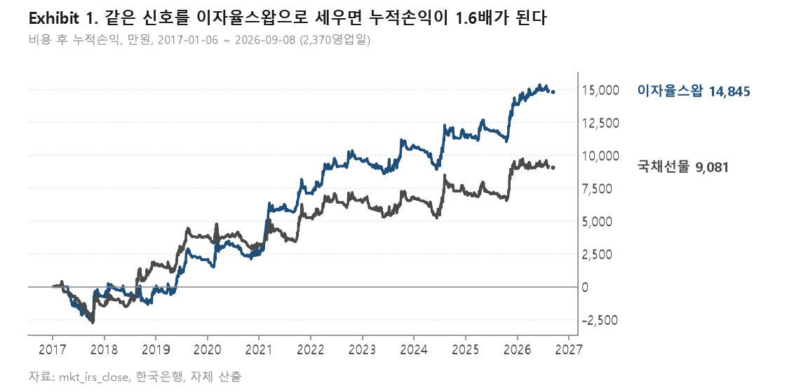
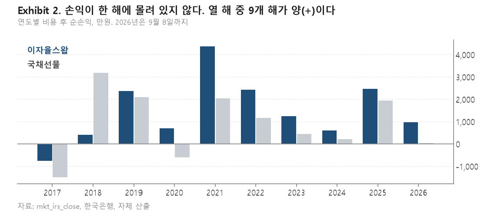
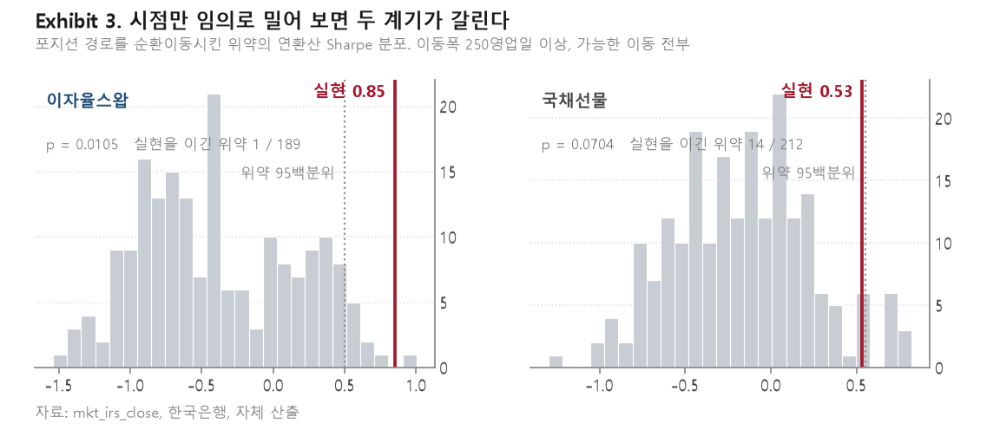
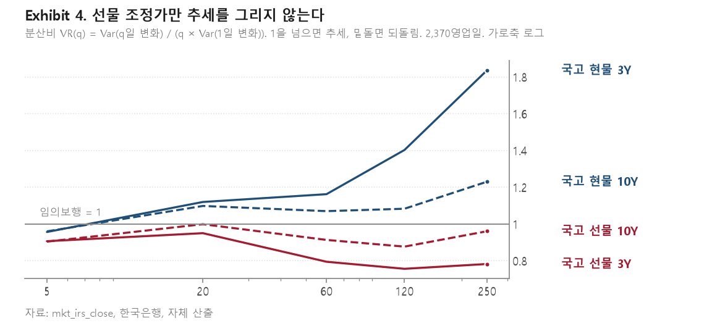
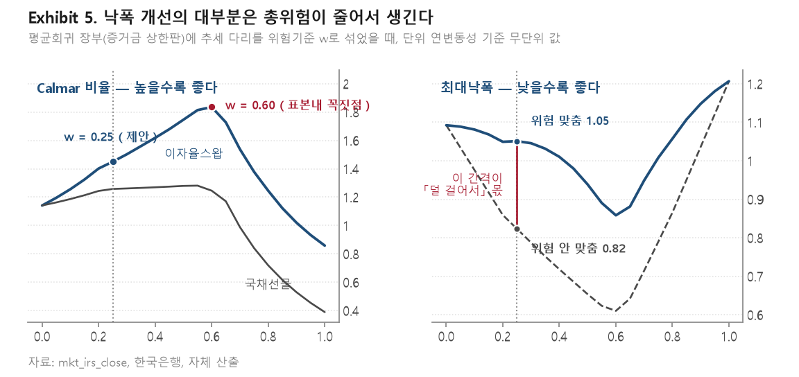
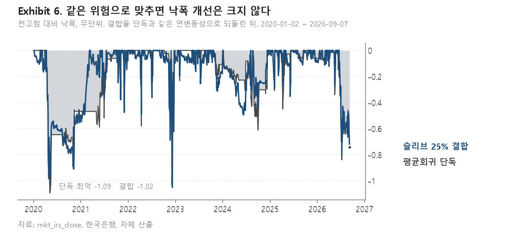

# 원화 이자율스왑 시계열 모멘텀 전략

검토 결과 보고

---

## Ⅰ. 요약

본 보고서는 원화 이자율스왑(IRS) 3년물과 10년물을 대상으로 하는 시계열 모멘텀
(Time-Series Momentum) 전략의 검토 결과를 보고한다. 분석기간은 2017년 1월 6일부터
2026년 9월 8일까지 2,370영업일(9.40년)이다.

| 항목 | 값 |
|---|---|
| 연환산 Sharpe 비율 | 0.851 |
| 자기상관 보정 Sharpe 비율 | 0.912 (90% 구간 [0.340, 1.445]) |
| 비용 전 누적손익 | 18,278만원 |
| 거래비용 (편도 0.5bp) | 3,432만원 (비용 전 손익의 18.8%) |
| 비용 후 누적손익 | 14,845만원 |
| 양(+)의 손익을 기록한 연도 | 10개 연도 중 9개 |
| 일 회전율 | 0.1002 |

검토 결과는 다음 네 가지로 요약된다.

첫째, 본 전략은 데스크가 운용하는 평가기준의 세 관문을 모두 통과하였다. Deflated
Sharpe Ratio 0.9830, Probability of Backtest Overfitting 0.2335, 순환이동 무작위화
검정 p값 0.0105이다.

둘째, 동일한 신호를 국채선물로 실행한 구성은 세 관문 모두에서 통과하지 못하였다.
격차의 원인은 거래비용이나 회전율이 아니라 국채선물 조정가 계열이 추세를 형성하지
않는다는 데 있다.

셋째, 기존 평균회귀 장부와의 일별 손익 상관계수는 -0.030이며, 위험기준 25% 비중으로
결합하는 경우 Calmar 비율이 1.141에서 1.450으로 개선된다(90% 구간 [+0.017, +0.687],
P(개선 ≤ 0) = 0.040).

넷째, 다만 최대낙폭 개선분의 대부분은 결합으로 총위험이 감소한 데서 발생한다. 결합
장부를 단독과 동일한 연변동성으로 되돌려 측정하면 최대낙폭 개선은 -0.269에서
-0.041로 축소된다. 본 전략을 위기 국면의 방어수단으로 제시할 근거는 없다.

---

## Ⅱ. 전략의 구성

### 2.1 신호와 포지션

포지션 산출은 다음 네 단계를 따른다.

첫째, 계약별로 신호를 실현변동성으로 나누어 단위위험으로 정규화한다. 둘째, 룩백
다섯 개(20, 40, 60, 120, 250영업일)를 등가중 평균한다. 셋째, 미조정 장부의 과거
변동성을 산출한다. 넷째, 목표변동성을 해당 변동성으로 나눈 배수를 장부 전체에
적용한다. 셋째 단계에서 과거 정보만을 사용하는 것은 미래정보 유입을 방지하기
위함이다.

복수의 룩백을 선택하지 않고 등가중 합산하는 것은 문헌의 표준 관행이며, 데스크가
별도로 검정한 사항이기도 하다. 룩백을 매년 전진선택하는 구성은 고정 등가중 구성
대비 손실을 초래하였다.

### 2.2 계기와 회계

이자율스왑 par 금리는 부호를 반전한 -bp 계열로 변환하여 금리 하락이 이익이 되도록
한다. 합성가격을 구성하지 않으며, 손익 회계는 bp에 명목금액을 곱하는 방식이다.
스왑은 만기가 이월되는 계약이 아니므로 롤 비용과 롤 점프가 발생하지 않는다.

거래비용은 편도 0.5bp를 적용한다. 이는 데스크의 스프레드 패키지 거래 실측 수준이다.

---

## Ⅲ. 성과

### 3.1 단독 성과

<그림 1>은 동일한 신호를 두 계기로 실행한 경우의 비용 후 누적손익을 보여준다.

분석기간 전체에서 이자율스왑 구성은 14,845만원, 국채선물 구성은 9,081만원을
실현하였다. 비용 전 기준으로는 각각 18,278만원과 9,852만원으로 배수가 1.86이며,
비용 후 기준으로는 1.63이다.

주목할 점은 거래비용 부담이 이자율스왑 쪽에서 더 무겁다는 것이다. 회전율은
이자율스왑 0.1002, 국채선물 0.1125로 이자율스왑이 오히려 낮으나, 거래비용은
3,432만원 대 771만원으로 4.5배이다. 편도 0.5bp가 선물의 편도 0.5틱(3년물 기준
0.175bp)보다 비싸기 때문이다. 즉 이자율스왑 구성은 비용이 저렴하여 우위를 갖는
것이 아니라, 비용 전 손익이 1.86배여서 비용을 더 부담하고도 남는 구조이다.

### 3.2 시기별 분포

<그림 2>는 연도별 비용 후 순손익을 보여준다.

이자율스왑 구성은 10개 연도 중 9개 연도에서 양(+)의 손익을 기록하였으며, 음(-)의
연도는 2017년 단일이다. 금리인상기(2021년 8월 26일부터 2023년 1월 13일까지)의 손익
기여는 26.4%이며, 해당 구간을 제외하여도 Sharpe 비율 0.72가 유지된다. 손익이 가장
컸던 12개월 창을 제외하는 경우 Sharpe 비율은 0.851에서 0.59로 하락한다.

국채선물 구성은 분포가 다르다. 2018년 8월부터 2019년 8월까지의 12개월이 전체 손익의
59.9%를 차지하며, 해당 창을 제외하면 Sharpe 비율이 0.53에서 0.24로 하락한다.

---

## Ⅳ. 검정

### 4.1 세 관문

데스크의 평가기준은 세 개의 관문과 하나의 순위기준으로 구성된다. 관문은 AND
조건이며, 측정하지 못한 관문은 통과로 간주하지 않는다.

| 관문 | 이자율스왑 | 국채선물 | 문턱 |
|---|---|---|---|
| Deflated Sharpe Ratio | 0.9830 (통과) | 0.8954 (미통과) | > 0.95 |
| Probability of Backtest Overfitting | 0.2335 (통과) | 0.6786 (미통과) | < 0.50 |
| 순환이동 무작위화 검정 p값 | 0.0105 (통과) | 0.0704 (미통과) | < 0.05 |
| 필요 표본 대 실제 9.40년 | 5.66년 | 16.13년 | 해당없음 |
| 변동성정규화 CDaR 비율 (순위) | 0.0783 | 산출하지 않음 | 기준선 1.0 |

시행수는 신호계 3개, 변동성 윈도 3개, 다리 구성 4개, 계기 2개를 곱한 72로 계산하였다.
계기를 선택축에 포함한 것은 "이자율스왑이 낫다"는 판단이 두 계기를 모두 본 뒤에 나온
것이기 때문이다.

### 4.2 무작위화 검정

세 관문 중 표본길이에 의존하지 않는 것은 무작위화 검정 하나이다. 포지션 경로를
순환이동시켜 시점 정합성만을 제거하고 포지션 크기 분포, 회전율, 변동성 목표,
거래비용 구조는 그대로 보존한 뒤 성과를 재산출하였다. 이동폭은 최장 룩백인 250영업일
이상으로 제한하고 가능한 모든 이동을 열거하였다.

이자율스왑 구성의 경우 189개 위약 중 실현치를 상회한 것은 1개이며 p값은 0.0105이다.
국채선물 구성의 경우 212개 중 14개가 실현치를 상회하여 p값이 0.0704이다. 즉 국채선물
구성은 동일한 장부의 시점만을 임의로 이동시켜도 14회 중 1회 이상 실현 성과를
상회한다.

무작위화 검정은 계열 전체를 순환이동시키므로 계열이 판정 창보다 길면 새로운 관측이
추가될 때마다 위약분포가 달라진다. 본 보고서의 측정은 두 계기 모두 계열을 판정
창의 종료일에서 절단한 상태에서 수행하였으며, 따라서 추가 관측에 따른 변동이 없다.

이동폭 하한 세 수준(250, 500, 750)과 이동간격 세 수준(5, 10, 25)을 조합한 아홉 개
격자에서도 결론은 유지된다. 이자율스왑 구성은 아홉 개 중 여덟 개에서 유의수준 5%를
만족하며, 국채선물 구성은 아홉 개 모두에서 만족하지 못한다.

### 4.3 두 구성의 차이

두 구성의 일별 손익 상관계수는 +0.892이므로 각각의 신뢰구간을 대조하는 방식으로는
차이를 식별할 수 없다. 이에 블록 시작점을 한 번만 추출하여 두 계열에 동일하게
적용하는 짝지은 부트스트랩을 사용하였다. 분석 결과 자기상관 보정 Sharpe 비율의
차이는 +0.312(90% 구간 [+0.006, +0.660], P(차이 ≤ 0) = 0.048)로 방향이 식별되었다.

---

## Ⅴ. 계기 선택의 근거

### 5.1 신호와 수익 계열의 분리

격차가 신호에서 오는지 수익 계열에서 오는지를 분리하기 위하여 교차 설계를 적용하였다.

| 신호 (행) 대 수익 계열 (열) | 스왑 계열 | 선물 계열 |
|---|---|---|
| 스왑 신호 | 18,080만원 (SR 1.04) | 11,610만원 (SR 0.67) |
| 선물 신호 | 13,049만원 (SR 0.76) | 9,113만원 (SR 0.53) |

전체 배수 1.98은 신호 기여 약 1.4배와 수익계열 기여 약 1.4배로 분해된다.

이어서 스왑금리를 국고채 현물금리와 스왑스프레드로 분해하고 동일한 포지션 경로를 각
구성에 적용하였다. 국고채 금리 구성이 18,256만원으로 101%, 스왑스프레드 구성이
-176만원으로 -1%를 차지하였다. 스왑스프레드만을 대상으로 구성한 장부의 Sharpe 비율은
-1.06이다.

동일한 신호와 동일한 엔진 아래에서 세 계열의 성과는 국고채 현물금리 19,080만원
(SR 1.11), 스왑금리 18,080만원(SR 1.04), 국채선물 조정가 9,113만원(SR 0.53)이다.
따라서 격차는 스왑시장의 고유한 이점에서 발생하는 것이 아니라 국채선물 조정가 계열의
특성에서 발생한다.

### 5.2 국채선물 조정가 계열의 특성

<그림 4>는 분산비로 각 계열의 추세성을 측정한 결과이다.

국고채 현물금리 3년물의 분산비는 지평이 길어질수록 상승하여 250일 지평에서 1.84에
이르는 반면, 국채선물 3년물은 0.78로 하락한다. 10년물에서도 방향은 같다. 짝지은
차이를 산출한 결과 3년물은 다섯 개 지평 전부에서, 10년물은 다섯 개 중 네 개 지평에서
0을 배제하였다.

원인 후보 세 가지를 검정하여 모두 기각하였다.

첫째, 롤 비용은 192만원으로 격차의 2%에 불과하며, 롤일 38일을 제외하고 계열을
재구성하여도 분산비는 0.78에서 0.75로 개선되지 않았다. 둘째, 현물금리 고시의 평활화
가능성을 검토한 결과 현물금리 일별 변화의 1차 자기상관계수는 -0.035 및 -0.039,
무변동일 비율은 1.6% 및 1.8%로 스왑금리보다 오히려 낮았다. 셋째, 마감시각 불일치
가능성을 검토한 결과 동시 상관계수가 0.957 및 0.961인 반면 ±1일 시차 상관계수는
-0.02에서 -0.07 사이로 선후관계가 관측되지 않았다.

따라서 격차는 선물 조정가 계열 자체의 1일 반전 성분에서 기인한다. 해당 계열의 1차
자기상관계수는 -0.063 및 -0.072로 세 계열 중 가장 낮은 음(-)의 값을 보인다. 이
성분은 1일 분산을 증가시키는 반면 다기간 분산에는 누적되지 않으므로 분산비를
하락시킨다.

이 성분은 자료처리의 결함이 아니라 계열 자체의 성질이므로 자료 개선으로 해소될
가능성은 낮다고 판단한다. 따라서 본 전략의 계기는 이자율스왑으로 한다.

---

## Ⅵ. 기존 장부와의 결합

### 6.1 상관과 비중

본 전략은 단독 수익원으로 제시하기에는 규모가 작다. 실효성은 기존 평균회귀 장부와의
결합에서 나온다. 두 장부의 일별 손익 상관계수는 -0.030이다.

<그림 5>는 위험기준 비중 w를 0에서 1까지 변화시키며 결합 장부의 Calmar 비율과
최대낙폭을 측정한 결과이다. 측정 구간은 평균회귀 장부(증거금 상한판)와 겹치는
2020년 1월 2일부터 2026년 9월 7일까지 1,640영업일이다.

| w | Calmar 비율 | 최대낙폭 (위험 안 맞춤) | 최대낙폭 (위험 맞춤) | 혼합 연변동성 |
|---|---|---|---|---|
| 0.00 (평균회귀 단독) | 1.141 | 1.092 | 1.092 | 1.000 |
| 0.15 | 1.324 | 0.917 | 1.068 | 0.859 |
| 0.25 | 1.450 | 0.823 | 1.051 | 0.783 |
| 0.40 | 1.618 | 0.718 | 1.010 | 0.711 |
| 0.60 | 1.835 | 0.610 | 0.858 | 0.696 |
| 1.00 (추세 단독) | 0.858 | 1.207 | 1.207 | 1.000 |

w = 0.25에서의 Calmar 개선은 +0.309이며, 짝지은 블록 부트스트랩으로 산출한 90%
구간은 [+0.017, +0.687], P(개선 ≤ 0)은 0.040이다. 동일한 측정을 국채선물 구성에
적용하면 개선은 +0.117, P(개선 ≤ 0)은 0.240으로 식별되지 않는다.

### 6.2 낙폭 개선의 해석

최대낙폭에 관하여는 주의가 필요하다.

상관이 -0.03인 두 계열을 (1-w) 대 w로 섞으면 결합 장부의 총위험 자체가 감소한다.
w = 0.25에서 연변동성은 1.000에서 0.783으로 낮아진다. 이 상태에서 측정한 최대낙폭
감소(1.092에서 0.823)는 위험을 덜 부담한 결과를 포함한다.

결합 장부를 평균회귀 단독과 동일한 연변동성으로 되돌린 뒤 다시 측정하면 최대낙폭은
1.092에서 1.051로, 개선폭이 -0.269에서 -0.041로 축소된다. <그림 6>은 그 상태에서의
낙폭 곡선이다.

Calmar 비율은 분자와 분모가 같은 배수로 변하므로 척도에 불변이며, 따라서 6.1절의
개선 +0.309는 이 조정의 영향을 받지 않는다. 낙폭 지표만이 영향을 받는다.

이 구분은 실무적으로 중요하다. 본 전략은 평균회귀 장부가 손실을 기록하는 국면에서
이익을 보장하지 않으며, 실제로 2022년 10월 7일부터 11월 21일까지 두 장부는 동시에
손실을 기록하였다. 결합의 근거는 위기 방어가 아니라 상관이 0에 가까운 두 번째
수익원의 확보이다.

### 6.3 비중 w의 선택

<그림 5>가 보여주듯 Calmar 비율은 w = 0.60에서 1.835로 최댓값을 기록한다. 즉
w = 0.25는 표본내 최적점이 아니라 그 왼쪽에 위치한다.

본 보고서가 w = 0.25를 제시하는 근거는 최적화가 아니다. 표본내에서 w를 최적화하는
행위는 데스크가 별도로 검정하여 손실을 확인한 행위와 구별되지 않으며, 격자에서 매년
칸을 선택하는 구성은 고정 구성 대비 손실을 초래하였다. 또한 표본이 9.40년에
불과하므로 최댓값의 위치 자체가 표본에 따라 이동할 수 있다.

따라서 w = 0.25는 상승 구간 내에 보수적으로 위치시킨 배분값이다. w를 상향하는 경우
표본내 성과는 개선되나 검증되지 않은 전략에 대한 배분을 늘리는 것이므로, 변경은 사전
합의를 거치는 것이 타당하다.

---

## Ⅶ. 실행 방안

| 항목 | 내용 |
|---|---|
| 계기 | 원화 이자율스왑 3년물, 10년물 par 금리 |
| 신호 | 룩백 다섯(20·40·60·120·250영업일) 등가중 |
| 비중 | 위험기준 25%. 슬리브 목표 연변동성을 평균회귀 장부의 3분의 1로 설정 |
| 가동 | 상시 |
| 격자 | 등록된 칸 고정. 연간 재선택을 하지 않는다 |
| 거래비용 가정 | 편도 0.5bp |

가동 방식과 관련하여, 평균회귀 장부의 상태에 따라 추세 다리를 선택적으로 가동하는
다섯 가지 규칙을 검정하였다. 다섯 규칙 모두 상시 가동 구성의 위험조정 Calmar 비율을
하회하였으며, 각 규칙을 순환이동한 위약분포의 95백분위를 상회한 규칙은 없었다. 따라서
상시 가동으로 한다.

결합 방식에 관하여는 두 가지가 가능하며 선택을 요한다. 총위험을 고정하고 기존 위험
예산의 25%를 이전하는 방식은 본 보고서의 측정치가 전제하는 방식이며, 이 경우 절대
손익은 감소하고 위험조정지표가 개선된다. 기존 장부를 유지한 상태에서 슬리브를 추가하는
방식은 절대 손익과 총위험이 함께 증가하며, 증거금 소요에 대한 재측정이 필요하다.

모니터링 항목은 다음과 같다.

| 항목 | 기준 | 조치 |
|---|---|---|
| 실현 거래비용 | 비용 전 손익의 18.8% | 25% 초과 시 신호 반응함수와 변동성 추정기 개선 검토 |
| 두 장부의 일별손익 상관 | -0.030 | 절대값 0.3 초과가 6개월 지속되면 결합 근거 재검토 |
| 단독 Sharpe 비율 | 0.851 (90% 구간 하한 0.340) | 구간 하한 이탈 시 재평가 |
| 룩백과 신호계 | 등록 구성 고정 | 변경은 사전 합의를 거친다 |

---

## Ⅷ. 한계

본 전략의 검토 결과는 다음 세 가지 한계를 갖는다.

첫째, 표본 9.40년은 이 규모의 Sharpe 비율을 검정하기에 넉넉하지 않다. 데스크 평가기준의
허들을 역산하면 시행수를 1로 두어 선택벌점을 완전히 제거하여도 연환산 0.52가 요구되며,
허들의 약 4분의 3이 표본길이에서 기인한다. 참고로 SG CTA 지수의 실현 Sharpe 비율
0.61은 본 표본 길이로는 이 허들을 넘지 못한다. 본 전략의 관문 통과 역시 이 제약 위에
서 있다.

둘째, 본 전략의 Sharpe 비율 0.851은 산업 벤치마크와 통계적으로 구별되지 않는다. 운용
보수 2/20을 부과하여 단위를 맞추면 0.52에서 0.57 사이로 산출되어 SG CTA 지수 0.61을
하회하며, 반대로 산업 벤치마크를 보수 차감 전으로 환산하면 0.90에서 0.96 사이가 되어
본 전략을 상회한다. 양방향 검정에서 유의한 차이는 확인되지 않았다. 다만 Moskowitz
외(2012)가 보고한 시장당 평균 0.4를 기준으로 하면 본 전략은 이를 상회한다.

셋째, 거래 가능한 계기가 두 개에 한정되어 문헌이 보고하는 분산효과를 확보할 수 없다.
문헌은 추세추종 성과의 주된 원천이 시장 분산이라고 보고하며, 50개에서 70개 시장에
분산된 포트폴리오에서 Sharpe 비율 1.0 이상을 보고한다. 본 전략의 0.851은 개별 시장
수준과 단일 집단 분산 수준 사이에 위치한다.

이 제약의 해소 방안으로는 커브 기울기(10년물 대 3년물)를 별도 시장으로 추가하는 방안이
있다. 다만 평균회귀 장부가 이미 이자율스왑 커브 8종을 사용하고 있으므로 결합 상관
-0.030이 변동할 가능성이 있으며, 상관 측정이 선행되어야 한다. 아울러 신호 반응함수와
변동성 추정기를 개선하여 회전율을 3분의 1 감축하는 경우 비용 후 손익이 약 7.8%
개선될 것으로 추정되며, 신호를 변경하지 않는 개선이므로 우선순위가 높다.

---

## 부록. 수치의 재현

| 산출물 | 명령 |
|---|---|
| 관문 판정, 계기 비교, 짝지은 차이 | `python -m scripts.momentum_irs_evaluate` |
| 시기별 분포, 무작위화 검정, 격자 | `python -m scripts.hard_test` |
| 교차 설계, 스왑스프레드 분해, 분산비 | `python -m scripts.why_irs` |
| 결합 측정 | `python -m scripts.hedge_test` |
| 허들 역산, 벤치마크 대조 | `python -m scripts.gate_calibration` |
| 본 보고서의 그림 여섯 장 | `python make_charts.py` (`Projects/deliverables/추세슬리브제안/`) |

앞의 다섯 명령은 `backend/`에서 실행한다. 관문 판정문은
`backend/evaluation/reports/Momentum-trend-IRS.md` 및
`Momentum-trend-FUT-on-IRS-window.md`에 기록되어 있다. 측정 설계의 세부는
`docs/EVAL_LANE_STATE.md`를 참조하며, 결합 비중과 승인 요청 사항은
`docs/PROPOSAL_trend_sleeve_2026-09-11.md`가 진다.

그림을 그리는 스크립트는 하우스 차트 스타일(`research_style.py`) 옆에 두었으며,
산출물은 이 폴더에 기록된다. 해당 스크립트는 판정 스크립트의 함수를 그대로
호출하고, 무작위화 검정의 p값을 `_placebo_for`의 값과 대조하는 검사를 포함한다.
그림과 판정문이 어긋나면 실행이 중단된다.

### 참고문헌

Bailey, D. H., & López de Prado, M. (2014). The Deflated Sharpe Ratio. *Journal of
Portfolio Management*, 40(5).

Bailey, D. H., Borwein, J., López de Prado, M., & Zhu, Q. (2017). The Probability of
Backtest Overfitting. *Journal of Computational Finance*, 20(4).

Baltas, N., & Kosowski, R. (2017). Demystifying Time-Series Momentum Strategies:
Volatility Estimators, Trading Rules and Pairwise Correlations. Working Paper.

Chekhlov, A., Uryasev, S., & Zabarankin, M. (2005). Drawdown Measure in Portfolio
Optimization. *International Journal of Theoretical and Applied Finance*, 8(1).

Lo, A. W. (2002). The Statistics of Sharpe Ratios. *Financial Analysts Journal*, 58(4).

Moskowitz, T. J., Ooi, Y. H., & Pedersen, L. H. (2012). Time Series Momentum.
*Journal of Financial Economics*, 104(2).

Politis, D. N., & Romano, J. P. (1992). A Circular Block-Resampling Procedure for
Stationary Data. In *Exploring the Limits of Bootstrap*.
